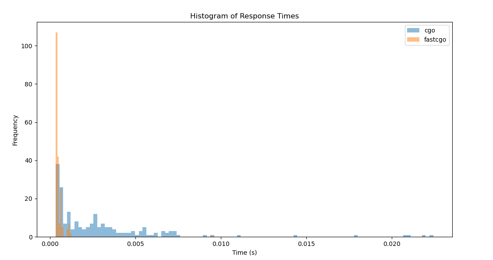

# Fast C Go server example

---

This repository serves as a server example to showcase the usage of CGO and fast C calls in Golang. 
The implementation of fast C calls utilizes code-generated CGO tools, 
replacing the `_cgo_runtime_cgocall` ^[ref](https://github.com/golang/go/blob/16ce8b3925deaeb72541ee96b6ee23a08fc21dea/src/runtime/cgocall.go#L125) function 
with `asmcgocall` ^[ref](https://github.com/golang/go/blob/master/src/runtime/stubs.go#L295) for improved performance in non-blocking operations such as math calculations, codec operations, zipping, cryptography, etc., where there are no IO operations involved.

The server implements two endpoints:

1. `/cgo/:size/:loop` - for general CGO C calls.
2. `/blockcall/:size/:loop` - for fast C calls.

Both APIs perform equal work when the `size` and `loop` arguments are identical.

The server was implemented to address the potential bottleneck introduced by using CGO calls in Golang, specifically concerning the handling of goroutines after a C call. When a C call is made, a goroutine can enter a global queue, which can increase the time it takes to handle requests.
You can easily test it by running the server and sending payloads to it.

```shell
# terminal 1
go build -o ./server && ./server
```
To test the server, simply run it and send requests to it using a tool like Apache Benchmark (ab).

```shell
# terminal 2
bash tests/run_once.sh $requests $concurrency $size $loop
```
$requests - Number of multiple requests to perform at a time. Default is one request at a time.
$concurrency - Number of requests to perform for the benchmarking session. The default is to just perform a single request which usually leads to non-representative benchmarking results.
$size - size of calculation matrix
$loop - times of matrix calculation

for example:

```shell
# terminal 2
bash tests/run_once.sh 200 10 62 2
```

The first terminal prints the log:
```shell
[GIN-debug] Listening and serving HTTP on :8080
                                         time
[GIN] 2024/03/25 - 21:14:38 | 200 |    2.260767ms |       127.0.0.1 | GET      "/cgo/62/2"
[GIN] 2024/03/25 - 21:14:38 | 200 |    2.928795ms |       127.0.0.1 | GET      "/cgo/62/2"
...

[GIN] 2024/03/25 - 21:14:42 | 200 |     367.986µs |       127.0.0.1 | GET      "/blockcall/62/2"
[GIN] 2024/03/25 - 21:14:42 | 200 |     382.728µs |       127.0.0.1 | GET      "/blockcall/62/2"
...
```
If you plot a histogram of request times for every endpoint, you will see a similar graph illustrating 
the server's performance for both general CGO C calls and fast C calls.

This histogram was ploted by [test-log/calc-histogram.py](test-log/calc-histogram.py) script



## Requrinment

1. Linux 64-bit (tested on x64 and ppc64)
2. Golang (1.18 higher for GIN framework)
3. Apache Benchmark (ab)

## How Build

```shell

go build -gcflags="fastc-example-server=-std" -o ./server
```

## How run

```shell
./server
```

## How test

```shell
go test -v -a -gcflags="fastc-example-server=-std"  fastc-example-server
```

